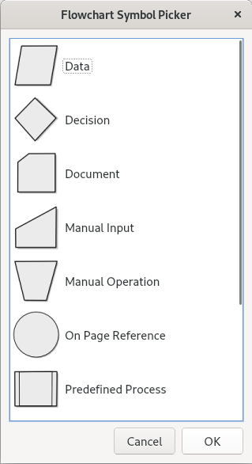
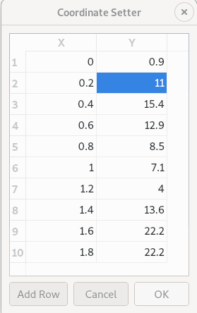
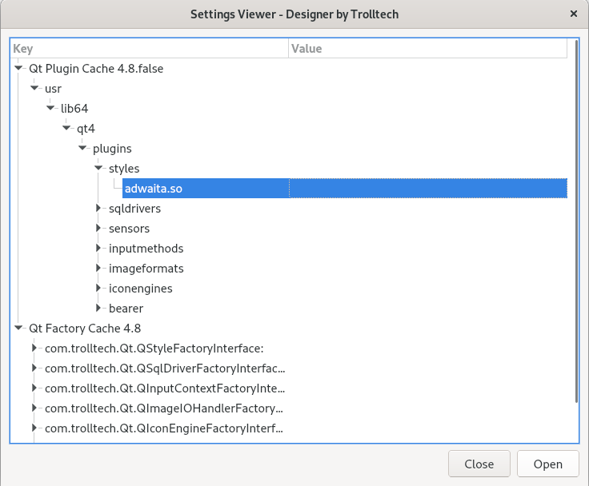

# 10. 项视图类

<!-- @import "[TOC]" {cmd="toc" depthFrom=1 depthTo=6 orderedList=false} -->
<!-- code_chunk_output -->

- [10. 项视图类](#10-项视图类)
  - [使用项视图的简便类](#使用项视图的简便类)
  - [Link](#link)

<!-- /code_chunk_output -->

许多应用程序允许用户搜索、查看和编辑属于某个数据集中的一些个别项。这些数据可以保存在文件中、数据库中或者网络服务器上。处理像这样的数据集的标准方式是使用 Qt 的项视图(item view class)。

在早期的 Qt 版本中，项视图窗口部件总是由一个数据集的所有内容组装而成的。用户在这个窗口部件的数据上进行所有的查询和编辑操作，并且在某些情况下，对数据的改变还会重新回写到数据源中。尽管这种方式很容易理解和使用，但是在使用非常大的数据集的时候，这种方式就不能很好地工作了，并且如果我们想在两个或者更多的窗口部件中显示同一数据集的时候，这种方式就不能很好地适应。

[Smalltalk](https://zh.wikipedia.org/wiki/Smalltalk) 语言普及了一种非常灵活的对于大数据集的可视化方法：模型 - 视图 - 控制器 (Model-View-Controller,MVC).在 MVC 方法中，模型代表数据集，它对需要查看数据的获取以及任何存储的改变负责。每种类型的数据集都有自己的模型，但不管底层的数据集是什么样子，模型提供给视图的 API 都是相同的。视图代表的是面向用户的那些数据。在同一时间，任何大数据集只有有限的部分是可见的，所以这个有限的部分就是视图所请求的那部分数据。控制器是用户和视图之间的媒介，它把用户的操作转换为浏览或者编辑数据的请求，这部分数据是根据需要由视图传递给模型的数据。

根据 MVC 方法的启示，Qt 提供了一种模型/视图架构。


在 Qt 中，这个模型和它在经典的 MVC 中的行为是完全相同的。 Qt 使用的不是控制器，而是使用了一些稍微有些不同的抽象：委托（delegate）。委托用于对项的如何显示和如何编辑提供精细控制。Qt 对每种类型的视图都提供了默认的委托。对于绝大多数应用程序，这已经足够了，所以我们通常不需要注意它。

利用 Qt 的模型/视图架构，我们可以只从模型中获取实际在视图中显示所需要的数据。这样在处理非常大的数据集的时候，可以更加快速，而不至于降低性能。通过把一个模型注册到一个或者多个视图，就可让用户使用不同的方式查看数据以及和数据交互。Qt 对于多个视图会自动的保持同步，从而使对一个视图的改变会影响到全部视图，如下图所示。


模型/视图的另外一个好处是：如果决定改变底层的数据集的存储方式，则只需要修改模型，而视图仍将能够继续正常工作。

在很多情况下，只需要把一小部分的项呈现给用户。在这些常见的例子中，可以使用 Qt 提供的那些方便的项视图类(QListWidget QTableWidget QTreeWidget) ,并且可以把它们和项直接组装起来。这些类和一些以前的 Qt 版本中提供的项视图类很相似。它们把数据存储在项中（eg： QTableWidget QTableWidgetItem）.实际上，在这些方便的类的内部，使用了自定义的模型，这样就可以让这些项在视图中变为可见的了。

对于大数据集，数据复制通常不是一个好方法。这是可以使用 Qt 的视图 (QListView QTableView QTreeView),把它们和一个数据模型连接，而这个模型即可以是自定义模型，也可以是 Qt 的预定义模型。例如，如果数据集被保存在一个数据库中，就可以把 QTableView 和 QSqlTableModel 组合在一起使用。

## 使用项视图的简便类

使用 Qt 的项视图中那些方便的子类通常要比定义一个自定义模型简单得多，并且如果我们不需要由区分模型和视图所带来的好处时，这种方法也是比较合适的。

这一节将说明如何使用这些方便的项视图的子类来显示项。

eg1:一个只读的 QListWidget,流程图符号选择器应用程序，每个项都由一个图标、一段文本和一个唯一的 ID 组成：



FlowChartSymbolPicker.h:
```c++
#ifndef FLOWCHARTSYMBOLPICKER_H
#define FLOWCHARTSYMBOLPICKER_H

#include <QDialog>
#include <QMap>

QT_BEGIN_NAMESPACE
class QDialogButtonBox;
class QIcon;
class QListWidget;
QT_END_NAMESPACE

class FlowChartSymbolPicker : public QDialog
{
    Q_OBJECT

public:
    FlowChartSymbolPicker(const QMap<int, QString> &symbolMap,
                          QWidget * parent = 0);

    // 获得一个选中的 ID （或者如果用户没有选中任何一项，就返回 -1）
    int selectedId() const { return id; }
    void done(int result) override;

private:
    QIcon iconForSymbol(const QString &symbolName);

    QListWidget * listWidget;
    QDialogButtonBox * buttonBox;
    int id;
};

#endif
```

FlowChartSymbolPicker.cpp:
```c++
#include <QtWidgets>

#include "FlowChartSymbolPicker.h"

FlowChartSymbolPicker::FlowChartSymbolPicker(
        const QMap<int, QString> &symbolMap, QWidget *parent)
    : QDialog(parent)
{
    // id 初始化为 -1
    id = -1;

    listWidget = new QListWidget;
    listWidget->setIconSize(QSize(60, 60));

    QMapIterator<int, QString> i(symbolMap);
    while (i.hasNext()) {
        i.next();
        QListWidgetItem * item = new QListWidgetItem(i.value(),
                                                    listWidget);
        item->setIcon(iconForSymbol(i.value()));

        // 把 ID 保存到 QListWidgetItem 中
        // QListWidgetItem 有几个角色(role)，每个角色都有一个关联的 QVariant。
        // 最常用的角色有 Qt::DisplayRole Qt::EditRole 和 Qt::IconRole ，
        // 并且这些角色都有方便的设置和获取函数[setText() 和 setIcon()],另外
        // 还有其他几个角色。通过指定一个大于等于 Qt::UserRole 的值，就可以
        // 定义自定义角色
        item->setData(Qt::UserRole, i.key());
    }

    buttonBox = new QDialogButtonBox(QDialogButtonBox::Ok
                                     | QDialogButtonBox::Cancel);

    connect(buttonBox, SIGNAL(accepted()), this, SLOT(accept()));
    connect(buttonBox, SIGNAL(rejected()), this, SLOT(reject()));

    QVBoxLayout * mainLayout = new QVBoxLayout;
    mainLayout->addWidget(listWidget);
    mainLayout->addWidget(buttonBox);
    setLayout(mainLayout);

    setWindowTitle(tr("Flowchart Symbol Picker"));
}

// 当用户单击 Ok 或者 Cancel 按钮时，就会调用它。
void FlowChartSymbolPicker::done(int result)
{
    id = -1;
    if (result == QDialog::Accepted) {
        QListWidgetItem * item = listWidget->currentItem();
        if (item)
            // 获取 ID
            id = item->data(Qt::UserRole).toInt();
            // 如果对项的文本感兴趣，则可以通过调用 item->data(Qt::DisplayRole).toString()
            // 或者更为方便的 item->text() 来获取文本
    }
    QDialog::done(result);
}

QIcon FlowChartSymbolPicker::iconForSymbol(const QString &symbolName)
{
    QString fileName = ":/images/" + symbolName.toLower();
    fileName.replace(' ', '-');
    return QIcon(fileName);
}
```

默认情况下，QListWidget 是只读的。如果想让用户编辑这些项，则可以使用 QAbstractItemView::setEditTriggers() 设置这个视图的编辑触发器。例如，QAbstractItemView::AnyKeyPressed 这个设置值的意思是：用户只要一开始输入就进入项的编辑状态。类似地，也可以提供一个 Edit 按钮（还可以提供 Add 和 Delete 按钮），同时使用信号-槽连接，这样就可以使用程序来控制编辑操作了。

eg2: 使用一个对话框，它显示的是用户可以编辑的一对(x,y) 坐标。



CoordinateSetter.h:
```c++
#ifndef COORDINATESETTER_H
#define COORDINATESETTER_H

#include <QDialog>
#include <QList>
#include <QPointF>

QT_BEGIN_NAMESPACE
class QDialogButtonBox;
class QTableWidget;
QT_END_NAMESPACE

class CoordinateSetter : public QDialog
{
    Q_OBJECT

public:
    CoordinateSetter(QList<QPointF> * coords, QWidget * parent = 0);

    void done(int result) override;

private slots:
    void addRow();

private:
    QTableWidget * tableWidget;
    QDialogButtonBox * buttonBox;
    QList<QPointF> * coordinates;
};

#endif
```

CoordinateSetter.cpp:
```c++
#include <QtWidgets>

#include "CoordinateSetter.h"

CoordinateSetter::CoordinateSetter(QList<QPointF> * coords,
                                   QWidget *parent)
    : QDialog(parent)
{
    coordinates = coords;

    tableWidget = new QTableWidget(0, 2);
    // 设置表窗口部件的水平表头项的文本
    tableWidget->setHorizontalHeaderLabels(
            QStringList() << tr("X") << tr("Y"));

    // 默认情况下，QTableWidget 会提供一个垂直表头，这个列的标签从 1 开始，
    // 这正是我们想要的，所以不需要手工设置垂直表头的标签。

    // 遍历，添加新行
    for (int row = 0; row < coordinates->count(); ++row) {
        QPointF point = coordinates->at(row);
        addRow();
        tableWidget->item(row, 0)->setText(QString::number(point.x()));
        tableWidget->item(row, 1)->setText(QString::number(point.y()));
    }

    // 默认情况下，QTableWidget 允许编辑。
    // 用户在这个视图所做的任何修改都会自动影响这些 QTableWidgetItem。
    // 为了防止编辑，可以调用 setEditTriggers(QAbstractItemView::NoEditTriggers)。

    buttonBox = new QDialogButtonBox(Qt::Horizontal);
    QPushButton * addRowButton = buttonBox->addButton(tr("&Add Row"),
            QDialogButtonBox::ActionRole);
    buttonBox->addButton(QDialogButtonBox::Ok);
    buttonBox->addButton(QDialogButtonBox::Cancel);

    connect(addRowButton, SIGNAL(clicked()), this, SLOT(addRow()));
    connect(buttonBox, SIGNAL(accepted()), this, SLOT(accept()));
    connect(buttonBox, SIGNAL(rejected()), this, SLOT(reject()));

    QVBoxLayout * mainLayout = new QVBoxLayout;
    mainLayout->addWidget(tableWidget);
    mainLayout->addWidget(buttonBox);
    setLayout(mainLayout);

    setWindowTitle(tr("Coordinate Setter"));
}

void CoordinateSetter::done(int result)
{
    if (result == QDialog::Accepted) {
        coordinates->clear();
        for (int row = 0; row < tableWidget->rowCount(); ++row) {
            double x = tableWidget->item(row, 0)->text().toDouble();
            double y = tableWidget->item(row, 1)->text().toDouble();
            coordinates->append(QPointF(x, y));
        }
    }
    QDialog::done(result);
}

void CoordinateSetter::addRow()
{
    int row = tableWidget->rowCount();

    tableWidget->insertRow(row);

    QTableWidgetItem * item0 = new QTableWidgetItem;
    item0->setTextAlignment(Qt::AlignRight | Qt::AlignVCenter);
    tableWidget->setItem(row, 0, item0);

    QTableWidgetItem * item1 = new QTableWidgetItem;
    item1->setTextAlignment(Qt::AlignRight | Qt::AlignVCenter);
    tableWidget->setItem(row, 1, item1);

    // 我们设置当前项，这样用户就可以开始编辑新的一行的第一项了
    tableWidget->setCurrentItem(item0);
}
```

eg3:使用 QTreeWidget 显示 Qt 应用程序设置。QTreeWidget 默认是只读的。



SettingsViewer.h:
```c++
#ifndef SETTINGSVIEWER_H
#define SETTINGSVIEWER_H

#include <QDialog>

QT_BEGIN_NAMESPACE
class QDialogButtonBox;
class QSettings;
class QTreeWidget;
class QTreeWidgetItem;
QT_END_NAMESPACE

class SettingsViewer : public QDialog
{
    Q_OBJECT

public:
    SettingsViewer(QWidget * parent = 0);

private slots:
    void open();

private:
    void readSettings();
    void addChildSettings(QSettings &settings, QTreeWidgetItem * item,
                          const QString &group);

    QTreeWidget * treeWidget;
    QDialogButtonBox * buttonBox;

    QString organization;
    QString application;
};

#endif
```

SettingsViewer.cpp:
```c++
#include <QtWidgets>

#include "SettingsViewer.h"

SettingsViewer::SettingsViewer(QWidget * parent)
    : QDialog(parent)
{
    // 为了访问应用程序的设置，必须使用组织名称和应用程序名称
    //作为参数创建 QSettings 对象。
    organization = "Trolltech";
    application = "Designer";

    treeWidget = new QTreeWidget;
    treeWidget->setColumnCount(2);

    treeWidget->setHeaderLabels(
            QStringList() << tr("Key") << tr("Value"));

    // 树形窗口部件的头视图控制了树形队列的大小
    // 设置两列的重定义模式为 Stretch。这就告诉了头视图总是确保列能够填充有用的空间。
    // 在这种模式下，用户或者程序都不能重新调整列的大小。
    treeWidget->header()->setSectionResizeMode(0, QHeaderView::Stretch); // replace setResizeMode()
    treeWidget->header()->setSectionResizeMode(1, QHeaderView::Stretch); // replace setResizeMode()

    buttonBox = new QDialogButtonBox(QDialogButtonBox::Open
                                     | QDialogButtonBox::Close);

    connect(buttonBox, SIGNAL(accepted()), this, SLOT(open()));
    connect(buttonBox, SIGNAL(rejected()), this, SLOT(close()));

    QVBoxLayout * mainLayout = new QVBoxLayout;
    mainLayout->addWidget(treeWidget);
    mainLayout->addWidget(buttonBox);
    setLayout(mainLayout);

    setWindowTitle(tr("Settings Viewer"));
    readSettings();
}

void SettingsViewer::open()
{
    QDialog dialog(this);

    QLabel * orgLabel = new QLabel(tr("&Organization:"));
    QLineEdit * orgLineEdit = new QLineEdit(organization);
    orgLabel->setBuddy(orgLineEdit);

    QLabel * appLabel = new QLabel(tr("&Application:"));
    QLineEdit * appLineEdit = new QLineEdit(application);
    appLabel->setBuddy(appLineEdit);

    QDialogButtonBox * buttonBox = new QDialogButtonBox(
            QDialogButtonBox::Ok | QDialogButtonBox::Cancel);

    connect(buttonBox, SIGNAL(accepted()), &dialog, SLOT(accept()));
    connect(buttonBox, SIGNAL(rejected()), &dialog, SLOT(reject()));

    QGridLayout * gridLayout = new QGridLayout;
    gridLayout->addWidget(orgLabel, 0, 0);
    gridLayout->addWidget(orgLineEdit, 0, 1);
    gridLayout->addWidget(appLabel, 1, 0);
    gridLayout->addWidget(appLineEdit, 1, 1);

    QVBoxLayout * mainLayout = new QVBoxLayout;
    mainLayout->addLayout(gridLayout);
    mainLayout->addWidget(buttonBox);
    dialog.setLayout(mainLayout);

    dialog.setWindowTitle(tr("Choose Settings"));

    if (dialog.exec()) {
        organization = orgLineEdit->text();
        application = appLineEdit->text();
        readSettings();
    }
}

void SettingsViewer::readSettings()
{
    QSettings settings(organization, application);

    treeWidget->clear();
    addChildSettings(settings, 0, "");

    treeWidget->sortByColumn(0);
    treeWidget->setFocus();
    setWindowTitle(tr("Settings Viewer - %1 by %2")
                   .arg(application).arg(organization));
}

// 用于创建所有的 QTreeWidgetItem
void SettingsViewer::addChildSettings(QSettings &settings,
        QTreeWidgetItem *parent, const QString &group)
{
    if (!parent)
        parent = treeWidget->invisibleRootItem();
    QTreeWidgetItem * item;

    settings.beginGroup(group);

    foreach (QString key, settings.childKeys()) {
        item = new QTreeWidgetItem(parent);
        item->setText(0, key);
        item->setText(1, settings.value(key).toString());
    }
    foreach (QString group, settings.childGroups()) {
        item = new QTreeWidgetItem(parent);
        item->setText(0, group);
        addChildSettings(settings, item, group);
    }
    settings.endGroup();
}
```

在这一节中所显示的项视图窗口部件允许我们使用和以前的 Qt 版本中类似的方式进行编程：读取要被设置到一个项视图窗口部件中的所有数据、使用项对象呈现数据元素并且回写数据源（如果这些项是可编辑的话）。在后面的几节中，我们将不再局限于这种简单的方式，并且会充分利用 Qt 模型/视图架构的所有好处。


## Link
* [qt5-book-code/chap10/](https://github.com/mutse/qt5-book-code/tree/master/chap10)

[上一级](README.md)
[上一篇](9_drag.md)
[下一篇](14_multiThread.md)
