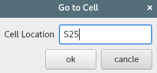

# 2.创建对话框

<!-- @import "[TOC]" {cmd="toc" depthFrom=1 depthTo=6 orderedList=false} -->
<!-- code_chunk_output -->

* [2.创建对话框](#2创建对话框)
	* [子类化QDialog](#子类化qdialog)
	* [深入介绍信号和槽](#深入介绍信号和槽)
	* [快速设计对话框](#快速设计对话框)

<!-- /code_chunk_output -->

## 子类化QDialog

dialog.h:
```c++
#ifndef DIALOG_H
#define DIALOG_H

#include <QDialog>
#include <QCheckBox>
#include <QLabel>
#include <QLineEdit>
#include <QPushButton>
#include <QString>


class Dialog : public QDialog
{
    Q_OBJECT //对于所有定义了信号和槽的类，再类定义开始处的Q_OBJECT宏都是必需的
public:
    explicit Dialog(QWidget * parent = 0);
    ~Dialog();

signals:
    void findNext(const QString,Qt::CaseSensitivity cs);
    void findPrevious(const QString,Qt::CaseSensitivity cs);

private slots:
    void findClicked();
    void enableFindButton(const QString &text);

private:
    QLabel * label;
    QLineEdit * linEdit;
    QCheckBox * caseCheckBox;
    QCheckBox * backwardCheckBox;
    QPushButton * findButton;
    QPushButton * closeButton;
};

#endif // DIALOG_H
```

dialog.cpp:
```c++
#include "dialog.h"
#include <QtGui> //该头文件包含了QT GUI类的定义
#include <QHBoxLayout>
#include <QVBoxLayout>

Dialog::Dialog(QWidget *parent) :
    QDialog(parent)
{
   label=new QLabel(tr("Find &what"));
   linEdit=new QLineEdit;
   label->setBuddy(linEdit);

   caseCheckBox=new QCheckBox(tr("Match &case"));
   //tr（）函数可以把他们翻译成其他语言的标记
   // & 来表示快捷键 Alt + 字母(例如c)
   backwardCheckBox=new QCheckBox(tr("search &Backward"));

   findButton=new QPushButton(tr("&Find"));
   findButton->setDefault(true);
   //使findbutton成为按下Enter键时能够按下对应的按钮
   findButton->setEnabled(false);

   closeButton=new QPushButton(tr("close"));

   connect(linEdit,SIGNAL(textChanged(QString)),
           this,SLOT(enableFindButton(const QString &)));

   connect(findButton,SIGNAL(clicked(bool)),this,SLOT(findClicked()));
   connect(closeButton,SIGNAL(clicked(bool)),this,SLOT(close()));

   QHBoxLayout * topLeftLayout=new QHBoxLayout;
   topLeftLayout->addWidget(label);
   topLeftLayout->addWidget(linEdit);

   QVBoxLayout * leftLayout=new QVBoxLayout;
   leftLayout->addLayout(topLeftLayout);
   leftLayout->addWidget(caseCheckBox);
   leftLayout->addWidget(backwardCheckBox);

   QVBoxLayout * rightLayout=new QVBoxLayout;
   rightLayout->addWidget(findButton);
   rightLayout->addWidget(closeButton);
   rightLayout->addStretch();

   QHBoxLayout * mainLayout=new QHBoxLayout;
   mainLayout->addLayout(leftLayout);
   mainLayout->addLayout(rightLayout);
   setLayout(mainLayout);

   setWindowTitle(tr("Find"));
   setFixedHeight(sizeHint().height());
   //QWidget::sizeHint()函数可以返回一个窗口比较理想的尺寸大小
}

void Dialog::findClicked()
{
    QString text=linEdit->text();
    Qt::CaseSensitivity cs=caseCheckBox->isChecked() ? Qt::CaseSensitive :
                                                       Qt::CaseInsensitive;
    if (backwardCheckBox->isChecked())
    {
        emit findPrevious(text,cs);
        //发射信号
    }
    else
    {
        emit findNext(text,cs);
    }


}

void Dialog::enableFindButton(const QString &text)
{
    findButton->setEnabled(!text.isEmpty());
}

Dialog::~Dialog()
{
//按照常理来讲，new了之后，我们需要delete.
//但是在QT中，这个并不是必需的，
//因为QT会在删除父对象的时候自动删除其所属的所有子对象
}
```

main.cpp:
```c++
#include "dialog.h"
#include <QApplication>

int main(int argc, char *argv[])
{
    QApplication a(argc, argv);
    Dialog w;
    w.show();

    return a.exec();
}

```

可以使用快捷键Alt+c等来触发相应的行为。可以通过Tab键来遍历这些窗口部件。默认的Tab键顺序就是创建窗口部件时的顺序。要改变这个键顺序，可以使用QWidget::setTabOrder()函数

fedora 27显示效果：


## 深入介绍信号和槽
槽和普通的C++函数几乎是一样的。
槽可以和信号连接在一起，在这种情况下，每当发射这个信号的时候，就会自动调用这个槽。

```c++
connect(QObject * sender,SIGNAL(signal),QObject * receiver,SLOT(slot));
```
* 一个信号可以连接多个槽
```c++
connect(slider,SIGNAL(valueChanged(int)),spinBox,SLOT(setValue(int)));
connect(slider,SIGNAL(valueChanged(int)),spinBox,SLOT(updateStatusBarIndicator(int)));
```
在发射这个信号的时候，会以不确定的顺序一个接一个地调用这些槽。

* 多个信号可以连接同一个槽
* 一个信号可以与另一个信号相连接
```c++
connect(lineEdit,SIGNAL(textChanged(const QString &)),this,SIGNAL(updateRecord(const QString &)));
```
* 连接可以被移除
```c++
disconnect(lcd,SIGNAL(overflow()),this,SLOT(handleMathError()));
```

要把信号成功连接到槽（或者连接到另外一个信号），他们的参数必须具有相同的顺序和相同的类型：
```c++
connect(ftp,SIGNAL(rawCommandReply(int,const QString &)),this,SLOT(processReply(int,const Qstring &)));
```

这里有一个例外，如果信号的参数比它所连接的槽的参数多，那么多余的参数就会被简单地忽略掉：
```c
connect(ftp,SIGNAL(rawCommandReply(int,const QString &)),this,SLOT(checkErrorCode(int)));
```

## 快速设计对话框
Qt designer为程序员提供了可供使用的新选择，它提供一种可视化的设计能力。

在利用qt designer设计好相关的ui后
1. 添加main.cpp:
```c++
#include <QApplication>
#include <QDialog>

#include "ui_gotocelldialog.h"

int main(int argc,char **argv)
{
QApplication app(argc,argv);

Ui::GoToCellDialog ui;

QDialog * dialog=new QDialog;
ui.setupUi(dialog);
dialog->show();

return app.exec();
}
```
2. 运行
```sh
qmake-qt5 -project
qmake-qt5 gotocell.pro
```
3. 编译提示错误：
```
main.cpp:1:10: fatal error: QApplication: No such file or directory
 #include <QApplication>
          ^~~~~~~~~~~~~~
compilation terminated.
```
解决办法：
```
Adding QT += widgets in .pro file
```
4. 创建一个新类，让该类同时从QDialog和Ui::GoToCellDialog中继承出来，并且由它来实现那些缺失的功能
gotocelldialog.h
```c++
#ifndef GOTOCELLDIALOG_H
#define GOTOCELLDIALOG_H

#include <QDialog>
#include "ui_gotocelldialog.h"

class GoToCellDialog:public QDialog,public Ui::GoToCellDialog
{
    Q_OBJECT
public:
    GoToCellDialog(QWidget * parent=0);
private slots:
    void on_lineEdit_textChanged();
};


#endif // GOTOCELLDIALOG_H

```
gotocelldialog.cpp:
```c++
#include <QtGui>

#include "gotocelldialog.h"

GoToCellDialog::GoToCellDialog(QWidget *parent):QDialog(parent)
{
    setupUi(this);

    QRegExp regExp("[A-Za-z][1-9][0-9]{0,2}");
    lineEdit->setValidator(new QRegExpValidator(regExp,this));
    //QRegExpValidator检验器类
    //this传递给QRegExpValidator的构造函数，使它成为GoToCellDialog对象的一个子对象。
    //这样，以后就不用担心有关删除QRegExpValidator的事情了

    connect(okButton,SIGNAL(clicked(bool)),this,SLOT(accept()));
    connect(cancelButton,SIGNAL(clicked(bool)),this,SLOT(reject()));
}

void GoToCellDialog::on_lineEdit_textChanged()
{
    okButton->setEnabled(lineEdit->hasAcceptableInput());
}
```
5. 更改main.h
```c++
#include <QApplication>
#include <QDialog>
#include "gotocelldialog.h"

int main(int argc,char **argv)
{
QApplication app(argc,argv);
GoToCellDialog * dialog=new GoToCellDialog;
dialog->show();

return app.exec();
}
```
显示效果：


[上一级](base.md)
[上一篇](1_hello_qt.md)
