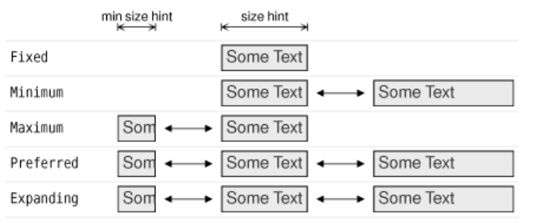
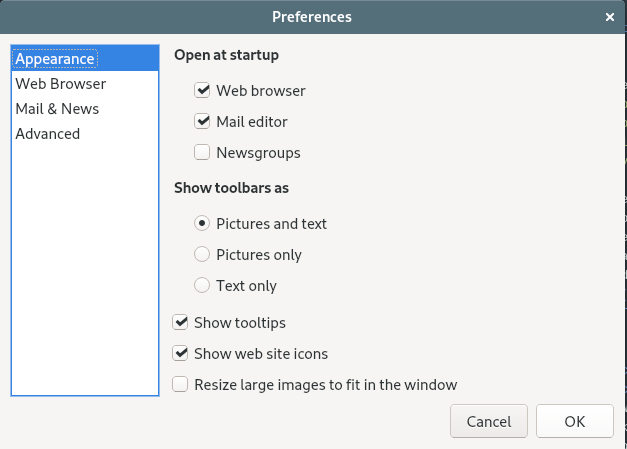
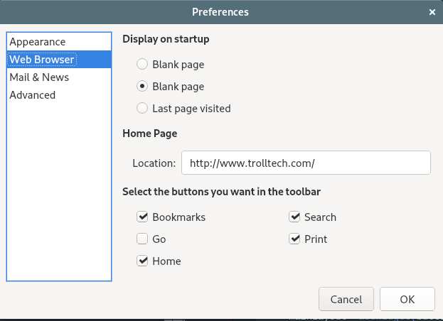
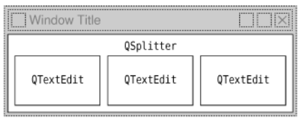
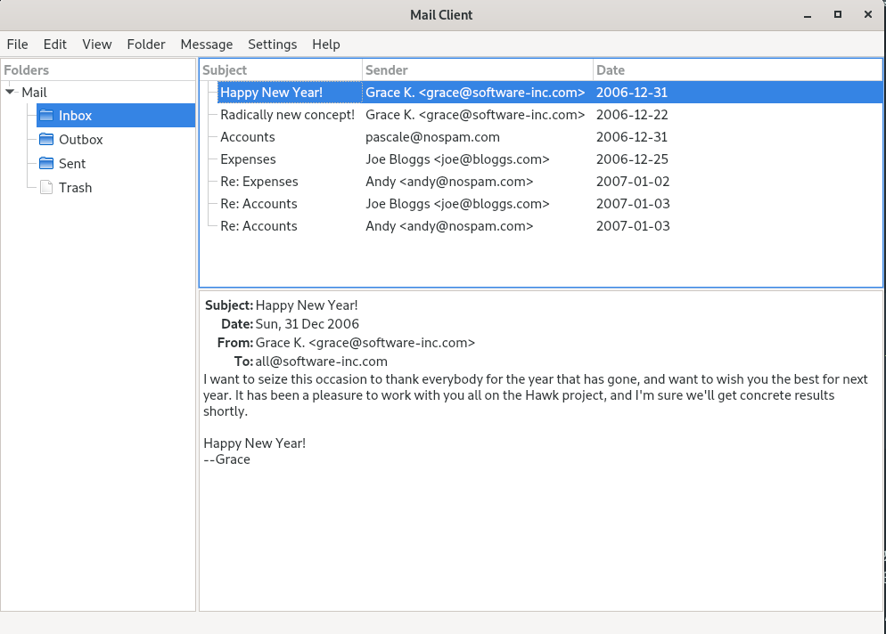
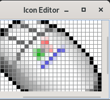
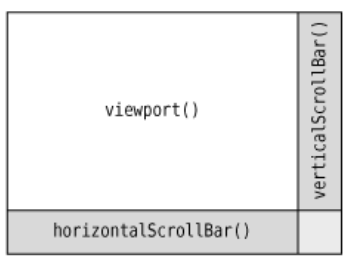
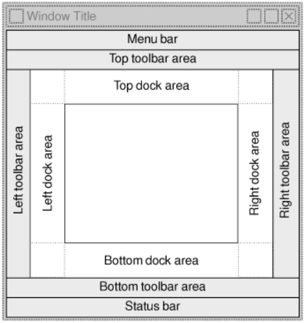
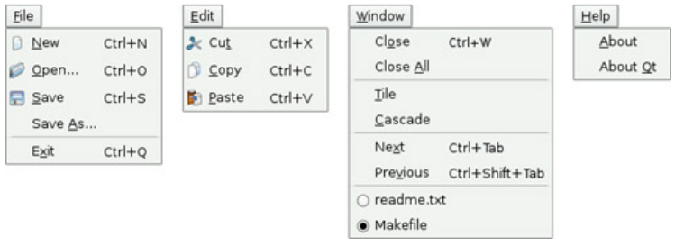

# 6. 布局管理


<!-- @import "[TOC]" {cmd="toc" depthFrom=1 depthTo=6 orderedList=false} -->
<!-- code_chunk_output -->

- [6. 布局管理](#6-布局管理)
  - [在窗体中摆放窗口部件](#在窗体中摆放窗口部件)
  - [分组布局](#分组布局)
  - [切分窗口](#切分窗口)
  - [滚动区域](#滚动区域)
  - [停靠窗口和工具栏](#停靠窗口和工具栏)
  - [多文档界面](#多文档界面)
    - [MainWindow.h](#mainwindowh)
    - [MainWindow.cpp](#mainwindowcpp)
    - [Editor.h](#editorh)
    - [Editor.cpp](#editorcpp)
  - [Link](#link)

<!-- /code_chunk_output -->


放置在窗体的每一个部件都必须给定一个合适的大小和位置。Qt 提供了多个用于在窗体中摆放窗口部件的类： [QHBoxLayout](https://doc.qt.io/qt-5/qhboxlayout.html)、 [QVBoxLayout](https://doc.qt.io/qt-5/qvboxlayout.html)、 [QGridLayout](https://doc.qt.io/qt-5/qgridlayout.html)和 [QStackedLayout](https://doc.qt.io/qt-5/qstackedlayout.html)。

使用 Qt 布局类的另外一个原因是：它们可以确保窗体能够自动适应于不同的字体、语言和系统平台。

可以执行布局管理功能的类还有 [QSplitter](https://doc.qt.io/qt-5/qsplitter.html) 、 [QScrollArea](https://doc.qt.io/qt-5/qscrollarea.html) 、 [QMainWindow](https://doc.qt.io/qt-5/qmainwindow.html) 、 [QMdiArea](https://doc.qt.io/qt-5/qmdiarea.html)。 这些类所拥有的共同点在于它们提供了一种用户可以灵活掌控的布局方式。

## 在窗体中摆放窗口部件

管理窗体上子窗口部件的布局：
1. 绝对位置法(最原始的)：这可以通过对窗体的各个子窗口部分分配固定的大小和位置以及对窗体分配固定的大小实现。
```c++
FindFileDialog::FindFileDialog(QWidget *parent)
    : QDialog(parent)
{
    ...
    namedLabel->setGeometry(9, 9, 50, 25);
    namedLineEdit->setGeometry(65, 9, 200, 25);
    lookInLabel->setGeometry(9, 40, 50, 25);
    lookInLineEdit->setGeometry(65, 40, 200, 25);
    subfoldersCheckBox->setGeometry(9, 71, 256, 23);
    tableWidget->setGeometry(9, 100, 256, 100);
    messageLabel->setGeometry(9, 206, 256, 25);
    findButton->setGeometry(271, 9, 85, 32);
    stopButton->setGeometry(271, 47, 85, 32);
    closeButton->setGeometry(271, 84, 85, 32);
    helpButton->setGeometry(271, 199, 85, 32);

    setWindowTitle(tr("Find Files or Folders"));
    setFixedSize(365, 240);
}

```
2. 人工布局法（通过重新实现窗体的 resizeEvent() 函数）：将子窗口的大小尺寸设置为与窗口的大小成比例
```c++
void FindFileDialog::resizeEvent(QResizeEvent * /* event */)
{
    int extraWidth = width() - minimumWidth();
    int extraHeight = height() - minimumHeight();

    namedLabel->setGeometry(9, 9, 50, 25);
    namedLineEdit->setGeometry(65, 9, 100 + extraWidth, 25);
    lookInLabel->setGeometry(9, 40, 50, 25);
    lookInLineEdit->setGeometry(65, 40, 100 + extraWidth, 25);
    subfoldersCheckBox->setGeometry(9, 71, 156 + extraWidth, 23);
    tableWidget->setGeometry(9, 100, 156 + extraWidth,
                             50 + extraHeight);
    messageLabel->setGeometry(9, 156 + extraHeight, 156 + extraWidth,
                              25);
    findButton->setGeometry(171 + extraWidth, 9, 85, 32);
    stopButton->setGeometry(171 + extraWidth, 47, 85, 32);
    closeButton->setGeometry(171 + extraWidth, 84, 85, 32);
    helpButton->setGeometry(171 + extraWidth, 149 + extraHeight, 85,
                            32);
}
```
3. 布局管理器法（最简便易行）


```c++
FindFileDialog::FindFileDialog(QWidget *parent)
    : QDialog(parent)
{
    ...


    // QGridLayout::addWidget() 调用遵循如下语法：
    // layout->addWidget(widget,row,column,rowSpan,columnSpan);
    // widget 要插入到布局中的子窗口部件
    // (row,column) 是由该窗口部件部件所占用的左上角单元格
    // rowSpan 是该窗口部件要占用的行数
    // columnSpan 是该窗口部件要占用的列数
    // 如果省略了这些参数，则参数 rowSpan 和 columnSpan 将会取默认值 1。
    QGridLayout * leftLayout = new QGridLayout;
    leftLayout->addWidget(namedLabel, 0, 0);
    leftLayout->addWidget(namedLineEdit, 0, 1);
    leftLayout->addWidget(lookInLabel, 1, 0);
    leftLayout->addWidget(lookInLineEdit, 1, 1);
    leftLayout->addWidget(subfoldersCheckBox, 2, 0, 1, 2);
    leftLayout->addWidget(tableWidget, 3, 0, 1, 2);
    leftLayout->addWidget(messageLabel, 4, 0, 1, 2);

    QVBoxLayout * rightLayout = new QVBoxLayout;
    rightLayout->addWidget(findButton);
    rightLayout->addWidget(stopButton);
    rightLayout->addWidget(closeButton);
    // 告诉垂直布局管理器，它会占满布局中这一处空间
    // 在 Qt 设计师中，可以通过插入一个分隔符(spacer)来达到同样的效果。
    rightLayout->addStretch();
    rightLayout->addWidget(helpButton);

    QHBoxLayout * mainLayout = new QHBoxLayout;
    mainLayout->addLayout(leftLayout);
    mainLayout->addLayout(rightLayout);
    setLayout(mainLayout);

    setWindowTitle(tr("Find Files or Folders"));
}
```

通过一个 QHBoxLayout 一个 QGridLayout 和一个 QVBoxLayout ，该布局就得到处理。


对话框周围的边白和两个子窗口之间的间隔均被设置为默认值，该值取决于当前窗口部件的风格，但通过 [QLayout](https://doc.qt.io/qt-5/qlayout.html) 提供的 setContentsMargins() 和 setSpacing() ，可以对他们的值进行修改。

对于目前所探讨的问题，使用布局管理器的确为我们提供了很多额外的好处。如果往布局中添加一个窗口部件或者从布局中调用了hide() 或者 show() ，也同样能够做到自适应。如果一个子窗口部件的大小提示发生了变化，布局将会自动进行调整，从而把新的大小提示考虑进去。还有，布局管理器也会自动根据窗体中子窗口部件的最小大小提示和大小提示，从总体上为这个窗体设置一个最小尺寸。

在迄今为止所给出的例子中，我们只是简单地把窗口部件放置到布局中，并且使用一定地分隔符元素（拉伸因子）来占用任何多余的空间。但在某些情况下，由此形成的布局看起来可能还不是我们最想要的形式。在这些情形中，可以通过改变要摆放的窗口部件的大小尺寸策略和大小提示来调整布局。

一个窗口部件的大小策略会告诉布局系统应该如何对它进行拉伸或者压缩。Qt 为它所有的内置窗口部件都提供了合理的默认大小策略值，但是由于不可能为每一种可能产生的布局都提供唯一的默认值，所以在一个窗体中，开发人员改变它上面的一个或两个窗口部件的大小策略是非常普遍的现象。一个 [QSizePolicy](https://doc.qt.io/qt-5/qsizepolicy.html) 既包含一个水平分量又包含一个垂直分量。以下是一些最为常用的取值：
* Fixed - 该窗口部件不能被拉伸或者压缩
* Minimum - 该窗口部件的大小提示就是它的最小大小
* Maximum - 该窗口部件的大小提示就是它的最大大小
* Preferred - 该窗口部件的大小提示就是它比较合适的大小。但是如果需要，还是可以对该窗口部件进行拉伸或者压缩。
* Expanding - 可以拉伸或者压缩该窗口部件，并且它特别希望能够变高变长。

使用一个 显示“Some Text”文本的 QLabel 为例：



在图中，Preferred 和 Expanding 描述成了同样的效果。但是，它们之间到底有何不同呢？在重新改变一个既包含 Preferred 又包含 Expanding 窗口部件的尺寸大小时，多出来的空间就会分配给 Expanding 窗口部件，而 Preferred 窗口部件仍旧会按照原有大小提示而保持不变。

这里还有另外两种大小规则： MinimumExpanding 和 Ignored. 前者仅仅用于 Qt 老版本的极少数情况中，但是如今它已经不再会被用到了。一种比较好的方式是使用 Expanding ，并且再适当地对 minimumSizeHint() 进行重新实现即可。后者与 Expanding 相似，只是它可以忽略窗口部件的大小提示和最小大小提示。

除了大小规则中包含的水平方向和垂直方向两个分量之外，QSizePolicy 类还保存了水平方向和垂直方向的一个拉伸因子。这些拉伸因子可以用来说明在增大窗体的时候，对不同的子窗体部件应使用的不同放大比例。例如，假定在 QTextEdit 的上面还有一个 QTreeWidget ，并且希望这个 QTextEdit 的高度能够是 QTreeWidget 高度的两倍，那么就可以把这个 QTextEdit 在垂直方向上的拉伸因子设置为 2 ，而把 QTreeWidget 在垂直方向上的拉伸因子设置为 1。

影响布局方式的另一种方法是设置它的子窗口部件的最小大小、最大大小或固定大小。当布局管理器在摆放这些窗口部件的时候，它就会考虑这些约束条件。并且如果这样还不够的话，还可以对子窗口部件的类进行派生并且重新实现 sizeHint() 函数，由此获取所需的大小提示。

## 分组布局

[QStackedLayout](https://doc.qt.io/qt-5/qstackedlayout.html) 类可以对一组子窗口部件进行摆放，或者对它门进行“分页”，而且一次只显示其中一个，而把其他的子窗口部件或者分页都隐藏起来。 QStackedLayout 本身并不可见，并且对于用户改变分页也没有提供其他特有的方法。为方便起见，Qt 还提供了 [QStackedWidget](https://doc.qt.io/qt-5/qstackedwidget.html) 类，这个类提供了一个带内置 QStackedLayout 的 QWidget。

分页是从 0 开始编号的。要使某个特定的子窗口部件可见，可以用一个页号来调用 setCurrentIndex() 。使用 indexOf() 可以获取子窗口部件的页号。

```c++
PreferenceDialog::PreferenceDialog(QWidget *parent)
    : QDialog(parent)
{
    createAppearancePage();
    createWebBrowserPage();
    createMailAndNewsPage();
    createAdvancedPage();

    buttonBox = new QDialogButtonBox(QDialogButtonBox::Ok
                                     | QDialogButtonBox::Cancel);

    listWidget = new QListWidget;
    listWidget->addItem(tr("Appearance"));
    listWidget->addItem(tr("Web Browser"));
    listWidget->addItem(tr("Mail & News"));
    listWidget->addItem(tr("Advanced"));

    stackedLayout = new QStackedLayout;
    stackedLayout->addWidget(appearancePage);
    stackedLayout->addWidget(webBrowserPage);
    stackedLayout->addWidget(mailAndNewsPage);
    stackedLayout->addWidget(advancedPage);
    connect(listWidget, SIGNAL(currentRowChanged(int)),
            stackedLayout, SLOT(setCurrentIndex(int)));

    QGridLayout * mainLayout = new QGridLayout;
    mainLayout->setColumnStretch(0, 1);
    mainLayout->setColumnStretch(1, 3);
    mainLayout->addWidget(listWidget, 0, 0);
    mainLayout->addLayout(stackedLayout, 0, 1);
    mainLayout->addWidget(buttonBox, 1, 0, 1, 2);
    setLayout(mainLayout);

    connect(buttonBox, SIGNAL(accepted()), this, SLOT(accept()));
    connect(buttonBox, SIGNAL(rejected()), this, SLOT(reject()));

    setWindowTitle(tr("Preferences"));
    listWidget->setCurrentRow(0);
}
```

Preferences 对话框中的两个分页：



利用 Qt 设计师创建这样的对话框也是非常容易的：
1. 基于 "Dialog" 或者 "Widget" 模板，创建一个新的窗体。
2. 在这个窗体上添加一个 QListWidget 和 一个 QStackedWidget
3. 用一些子窗口部件和布局来填充每一个分页。
4. 使用水平布局，把这些窗口部件一个挨一个地摆放好。
5. 把这个列表窗口部件的 currentRowChanged(int) 信号与分组窗口部件的 setCurrentIndex(int) 槽连接起来。
6. 把列表的 currentRow 属性值设置为 0。

由于已经使用预先定义的信号和槽来实现了分页之间的切换操作，所以当我们在 Qt 设计师中预览这个对话框时，它将可以直接显示出正确的行为特性。
对于页数较少或者可能会保持较小的一些情况，一种比使用 QStackedWidget 和 QListWidget 更为简单的替换方法是使用 [QTableWidget](https://doc.qt.io/qt-5/qtablewidget.html).

## 切分窗口
[QSplitter](https://doc.qt.io/qt-5/qsplitter.html) 就是一个可以包含一些其他窗口部件的窗口部件。在切分窗口(splitter) 中的这些窗口部件会通过切分条(splitter handle) 而分隔开来。用户可以通过拖动这些切分条来改变切分窗口中子窗口部件的大小。切分窗口常常可以用作布局管理器的替代品，从而可以把更多的控制权交给用户。

QSplitter 中的子窗口部件将会自动按照创建时的顺序一个挨着一个地（或者一个在另外一个的下面）放在一起，并以切分窗口拖动条(splitter bar)来分隔相邻窗口部件。

```c++
#include <QtWidgets>

int main(int argc, char *argv[])
{
    QApplication app(argc, argv);

    QTextEdit * editor1 = new QTextEdit;
    QTextEdit * editor2 = new QTextEdit;
    QTextEdit * editor3 = new QTextEdit;

    QSplitter splitter(Qt::Horizontal);
    splitter.addWidget(editor1);
    splitter.addWidget(editor2);
    splitter.addWidget(editor3);

    ...

    splitter.setWindowTitle(QObject::tr("Splitter"));
    splitter.show();
    return app.exec();
}

```


原理图：


与布局管理器不同之处在于，布局管理器只是简单地摆放一个窗体中的子窗体部件并且也没有可见地外形，但 QSplitter 是从 QWidget 派生的，并且在使用的时候，它也可以像任何其他窗口部件一样使用。

通过对多个 QSplitter 进行水平或者垂直方向的嵌套，就可以获得更为复杂的一些布局。
eg： Mail Client



布局图：


```c++
MailClient::MailClient()
{
    ...

    rightSplitter = new QSplitter(Qt::Vertical);
    rightSplitter->addWidget(messagesTreeWidget);
    rightSplitter->addWidget(textEdit);
    // 把位置 1 处的窗口部件(textEdit)的伸展因子设置为 1。
    rightSplitter->setStretchFactor(1, 1);

    mainSplitter = new QSplitter(Qt::Horizontal);
    mainSplitter->addWidget(foldersTreeWidget);
    mainSplitter->addWidget(rightSplitter);
    // 把位置 1 处的窗口部件(rightSplitter)的伸展因子设置为 1。
    // 结合上面的 setStretchFactor() 就可以确保 textEdit 总是可以获取那些任何多余的可用空间。
    mainSplitter->setStretchFactor(1, 1);
    setCentralWidget(mainSplitter);

    setWindowTitle(tr("Mail Client"));
    readSettings();
}
```

在程序中，可以通过调用 QSplitter::setSize() 来移动切分条。 QSplitter 类也可以保存它的状态，并且在下次运行程序的时候直接恢复它的状态值。

```c++
void MailClient::readSettings()
{
    QSettings settings("Software Inc.", "Mail Client");

    settings.beginGroup("mainWindow");
    restoreGeometry(settings.value("geometry").toByteArray());
    mainSplitter->restoreState(
            settings.value("mainSplitter").toByteArray());
    rightSplitter->restoreState(
            settings.value("rightSplitter").toByteArray());
    settings.endGroup();
}

void MailClient::writeSettings()
{
    QSettings settings("Software Inc.", "Mail Client");

    settings.beginGroup("mainWindow");
    settings.setValue("geometry", saveGeometry());
    settings.setValue("mainSplitter", mainSplitter->saveState());
    settings.setValue("rightSplitter", rightSplitter->saveState());
    settings.endGroup();
}
```

Qt 设计师完全支持 QSplitter。要把多个窗口部件放到一个切分窗口中，可以先把这些子窗口部件放置在期望的大致位置，选中它们，然后在单击 From -> Lay Out Horizontal in Splitter 或者 From -> Lay Out Vertical in Splitter

## 滚动区域
[QScrollArea](https://doc.qt.io/qt-5/qscrollarea.html) 类提供了一个可以滚动的视口和两个滚动条。如果想给一个窗口部件添加一个滚动条，则可以使用一个 QScrollArea 类来实现，这可能要比我们自己通过初始化 [QScrollBar](https://doc.qt.io/qt-5/qscrollbar.html),然后再实现它的滚动等功能简单得多。

QScrollArea 的使用方法，就是以我们想要添加滚动条的窗口部件作为参数调用 setWidget() . 如果这个窗口部件的父对象不是视口，QScrollArea 会自动把这个窗口部件的父对象重定义为该视口(可以通过 qscrollarea::viewport()来访问)
，并且让他成为为视口的子对象。

eg:
```c++
int main(int argc, char *argv[])
{
    QApplication app(argc, argv);
    IconEditor iconEditor;

    iconEditor.setIconImage(QImage(":/images/mouse.png"));

    QScrollArea scrollArea;
    scrollArea.setWidget(&iconEditor);
    scrollArea.viewport()->setBackgroundRole(QPalette::Dark);
    scrollArea.viewport()->setAutoFillBackground(true);
    scrollArea.setWindowTitle(QObject::tr("Icon Editor"));
    scrollArea.show();
    return app.exec();
}
```



QScrollArea 的窗口部件构成：


默认情况下，只有在视口的大小小于子窗口部件的大小时，才会把滚动条显示出来。但通过设置滚动条i策略，可以强制滚动条总是可见：
```c++
scrollArea.setHorizontalScrollBarPolicy(Qt::ScrollBarAlwaysOn);
scrollArea.setVerticalScrollBarPolicy(Qt::ScrollBarAlwaysOn);
```

## 停靠窗口和工具栏

停靠窗口 ([dock window](https://doc.qt.io/qt-5/qtwidgets-mainwindows-dockwidgets-example.html)) 是指一些可以停靠在 QMainWindow 中或是浮动为独立窗口的窗口。 QMainWindow 提供了四个停靠窗口区域：分别在中央窗口部件的上部、下部、左侧和右侧。诸如 Microsoft Visual Studio 和 [Qt Linguist](https://doc.qt.io/qt-5/qtlinguist-index.html) 这样的应用程序都广泛使用了停靠窗口，以提供一种非常灵活的用户接口方式。在 Qt 中，各个停靠窗口都是 [QDockWidget](https://doc.qt.io/qt-5/qdockwidget.html) 的实例。

每一个停靠窗口都有自己的标题栏，即使它处于停靠也是如此。通过拖拽这一标题栏，用户可以把停靠窗口从一个停靠区域移动到另一个停靠区域。通过把这个停靠窗口拖动到其他停靠区域的外面，就可以把停靠窗口从一个停靠区域种分离出来，让他成为一个独立的窗口。自由浮动的停靠窗口总是显示在它们的主窗口的上面。通过点击窗口部件标题栏上的 "关闭" 按钮，就可以关闭 QDockWidget 。通过 调用 QDockWidget::setFeatures() ，就可以禁用所有这些特性以及它们的任意组合。

在 Qt 的早期版本中，工具栏采用与停靠窗口一样的处理方式，并且共享同一停靠区域。从 Qt 4 开始，工具栏围绕中央窗口部件，占有它们自己的区域，并且不能取消停靠(undock)。如果需要一个浮动工具栏，只需把它放进 QDockWidget 即可。

QMainWindow 的停靠区域和工具栏区域：


用虚线显示的四个角可以属于两个相邻停靠区域中的任何一个。例如，假定我们需要让左上角属于左侧的停靠区域，则只需调用 QMainWindow::setCorner(Qt::TopLeftCorner,Qt::LeftDockWidgetArea) 即可。

以下程序片段说明了如何对 QDockWidget 中已经存在的窗口部件进行封装，并把它插入到右侧的停靠区域：
```c++
qdockwidget * shapesDockWidget = new QDockWidget(tr("Shapes"));
shapesDockWidget->setObjectName(
  "shapesDockWidget");
shapesDockWidget->setWidget(treeWidget);
// 该调用说明对停靠区域加以限定即可以接受停靠窗口。
// 如果没有明确地设置所允许的区域，
// 那么用户就可以把该停靠窗口拖动到这四个可停靠区域中的任何一个地方。
shapesDockWidget->setAllowedAreas(
  Qt::LeftDockWidgetArea | Qt::RightDockWidgetArea);
addDockWidget(Qt::RightDockWidgetArea,shapesDockWidget);
```

每个 QObject 都可以给定一个 “对象名”。在进行程序调试时，这个名字会非常有用，并且一些测试工具也会用到它。通常，我们不必费尽地给定窗口部件的名字，但是在创建一些停靠窗口和工具栏时，如果希望使用 QMainWindow::saveState() 和 QMainWindow::restoreState() 来保存、恢复停靠窗口和工具栏的几何形状的话，给定窗口部件的名字就很有必要了。

eg：
```c++
QToolBar * fontToolBar = new QToolBar(tr("Font"));
fontToolBar->setObjectName("fontToolBar");
fontToolBar->addWidget(familyComboBox);
fontToolBar->addWidget(sizeSpinBox);
fontToolBar->addAction(boldAction);
fontToolBar->addAction(italicAction);
fontToolBar->addAction(underLineAction);
fontToolBar->setAllowedAreas(Qt::TopToolBarArea
                        |Qt::BottomToolBarArea);
addToolBar(fontToolBar);

void mainWindow::writeSettings()
{
  QSettings settings("Software Inc.","Icon Editor");

  settings.beginGroup("mainWindow");
  settings.setValue("geometry",saveGeometry());
  settings.setValue("state",saveState());
  settings.endGroup();
}

void MailClient::readSettings()
{
    QSettings settings("Software Inc.", "Icon Editor");

    settings.beginGroup("mainWindow");
    restoreGeometry(settings.value("geometry").toByteArray());
    restoreState(settings.value("state").toByteArray());
    settings.endGroup();
}
```
最后，QMainWindow 提供了一个上下文菜单，其中列出了所有的停靠窗口和工具栏。用户可以使用这个菜单关闭和恢复停靠窗口，也可以用它隐藏和恢复工具栏。

## 多文档界面

在主窗口的中央区域能够提供多个文档的那些应用程序就称为多文档界面(Multiple Document Interface,MDI)应用程序。在Qt 中，通过把 QMdiArea 类作为中央窗口部件，并且让每一个文档窗口都成为这个 QMdiArea 的子窗口部件，就可以创建一个多文档界面应用程序了。

对于多文档界面应用程序有一个惯例，就是为它提供一个 Window 菜单，这个菜单包含一些管理这些窗口以及这些窗口列表的命令。激活窗口会使用一个选择标记标识出来。用户通过在 Window 菜单中单击代表特定窗口的一项，就可以激活任何窗口。

应用程序界面：


菜单：


用到的一些类：
[QTimer](https://doc.qt.io/qt-5/qtimer.html) The QTimer class provides repetitive and single-shot timers

### MainWindow.h
```c++
#ifndef MAINWINDOW_H
#define MAINWINDOW_H

#include <QMainWindow>

QT_BEGIN_NAMESPACE
class QAction;
class QActionGroup;
class QLabel;
class QMdiArea;
class QMenu;
class QToolBar;
class Editor;
QT_END_NAMESPACE

class MainWindow : public QMainWindow
{
    Q_OBJECT

public:
    MainWindow();

public slots:
    void newFile();
    void openFile(const QString &fileName);

protected:
    void closeEvent(QCloseEvent * event) override;

private slots:
    void open();
    void save();
    void saveAs();
    void cut();
    void copy();
    void paste();
    void about();
    void updateActions();
    void loadFiles();

private:
    void createActions();
    void createMenus();
    void createToolBars();
    void createStatusBar();
    void addEditor(Editor * editor);
    Editor * activeEditor();

    QMdiArea * mdiArea;
    QLabel * readyLabel;
    QWidgetList windows;

    QMenu * fileMenu;
    QMenu * editMenu;
    QMenu * windowMenu;
    QMenu * helpMenu;
    QToolBar * fileToolBar;
    QToolBar * editToolBar;
    QActionGroup * windowActionGroup;
    QAction * newAction;
    QAction * openAction;
    QAction * saveAction;
    QAction * saveAsAction;
    QAction * exitAction;
    QAction * cutAction;
    QAction * copyAction;
    QAction * pasteAction;
    QAction * closeAction;
    QAction * closeAllAction;
    QAction * tileAction;
    QAction * cascadeAction;
    QAction * nextAction;
    QAction * previousAction;
    QAction * separatorAction;
    QAction * aboutAction;
    QAction * aboutQtAction;
};

#endif
```

### MainWindow.cpp
```c++
#include <QtWidgets>

#include "Editor.h"
#include "MainWindow.h"

MainWindow::MainWindow()
{
    mdiArea = new QMdiArea;
    setCentralWidget(mdiArea);
    // subWindowActivated 与将要用来保持更新 Window 菜单的槽连接起来
    //，并会根据应用程序的状态来启用或者禁用那些动作。
    connect(mdiArea, SIGNAL(subWindowActivated(QMdiSubWindow*)),
            this, SLOT(updateActions()));

    createActions();
    createMenus();
    createToolBars();
    createStatusBar();

    setWindowIcon(QPixmap(":/images/icon.png"));
    setWindowTitle(tr("MDI Editor"));

    // 我们把单触发定时器的时间间隔设置为 0 毫秒，以调用 loadFiles() 函数。
    // 对于这样的定时器，只要事件循环一空闲就会触发它。
    // 实际上，这意味着只要构造函数结束，同时在主窗口显示出来之后，它就会调用 loadFiles()。
    // 如果不这样做，而且如果还需要加载许多大文件的话，那么该构造函数在文件加载完毕之前就无法结束。
    // 在此期间，用户极有可能在屏幕上看不见任何东西，这样它可能会认为是应用程序启动失败了。
    QTimer::singleShot(0, this, SLOT(loadFiles()));
}

// 如果用户在命令行中启动该应用程序时使用了一个或者多个文件名，
// 那么这个函数就会加载每一个文件，并且会逐级层叠的方式显示这些子窗口，以便用户可以轻松地看到它们。
void MainWindow::loadFiles()
{
    // Qt 的一些特殊命令行选项，比如 -style 和 -font ,
    // QApplication 的构造函数会自动把它们从参数列表中剔除出去。
    // eg: mdieditor -style motif readme.txt
    // QApplication::arguments() 就会返回一个含有两个项的 QStringList.
    QStringList args = QApplication::arguments();
    args.removeFirst();
    if (!args.isEmpty()) {
        foreach (QString arg, args)
            openFile(arg);
        mdiArea->cascadeSubWindows();
    } else {
        newFile();
    }

    // 对编辑器窗口赋予焦点，并且可以确保调用 updateActions() 函数
    mdiArea->activateNextSubWindow();
}

void MainWindow::newFile()
{
    Editor * editor = new Editor;
    editor->newFile();
    addEditor(editor);
}

void MainWindow::openFile(const QString &fileName)
{
    Editor * editor = Editor::openFile(fileName, this);
    if (editor)
        addEditor(editor);
}

// 如果没有重新实现它的 closeEvent(),那么将不会给用户留下对那些“未保存变化”进行存储的任何机会。
void MainWindow::closeEvent(QCloseEvent *event)
{
    mdiArea->closeAllSubWindows();
    if (!mdiArea->subWindowList().isEmpty()) {
        // 这些子窗口其中之一 “忽略” 了它的关闭事件
        //（可能是因为用户撤销了一个 “未保存变化”的消息框)
        event->ignore();
    } else {
        event->accept();
    }
}

void MainWindow::open()
{
    Editor * editor = Editor::open(this);
    if (editor)
        addEditor(editor);
}

void MainWindow::save()
{
    if (activeEditor())
        activeEditor()->save();
}

void MainWindow::saveAs()
{
    if (activeEditor())
        activeEditor()->saveAs();
}

void MainWindow::cut()
{
    if (activeEditor())
        activeEditor()->cut();
}

void MainWindow::copy()
{
    if (activeEditor())
        activeEditor()->copy();
}

void MainWindow::paste()
{
    if (activeEditor())
        activeEditor()->paste();
}

void MainWindow::about()
{
    QMessageBox::about(this, tr("About MDI Editor"),
            tr("<h2>Editor 1.1</h2>"
               "<p>Copyright &copy; 2007 Software Inc."
               "<p>MDI Editor is a small application that demonstrates "
               "QMdiArea."));
}

// 每当一个新的子窗口成为激活窗口，或者在关闭最后一个子窗口时，
// 都会发射 subWindowActivated() 信号，就会调用该函数
void MainWindow::updateActions()
{
    // 只有存在激活窗口时，绝大多数的菜单项才会起作用。
    bool hasEditor = (activeEditor() != 0);
    bool hasSelection = activeEditor()
                        && activeEditor()->textCursor().hasSelection();

    saveAction->setEnabled(hasEditor);
    saveAsAction->setEnabled(hasEditor);
    cutAction->setEnabled(hasSelection);
    copyAction->setEnabled(hasSelection);
    pasteAction->setEnabled(hasEditor);
    closeAction->setEnabled(hasEditor);
    closeAllAction->setEnabled(hasEditor);
    tileAction->setEnabled(hasEditor);
    cascadeAction->setEnabled(hasEditor);
    nextAction->setEnabled(hasEditor);
    previousAction->setEnabled(hasEditor);
    separatorAction->setVisible(hasEditor);

    if (activeEditor())
        // 表示这是一个激活窗口。
        // 由于有了 QActionGroup 的帮助，
        // 就不必再明确的激活窗口进行解除选定操作了。
        activeEditor()->windowMenuAction()->setChecked(true);
}

void MainWindow::createActions()
{
    newAction = new QAction(tr("&New"), this);
    newAction->setIcon(QIcon(":/images/new.png"));
    newAction->setShortcut(QKeySequence::New);
    newAction->setStatusTip(tr("Create a new file"));
    connect(newAction, SIGNAL(triggered()), this, SLOT(newFile()));

    openAction = new QAction(tr("&Open..."), this);
    openAction->setIcon(QIcon(":/images/open.png"));
    openAction->setShortcut(QKeySequence::Open);
    openAction->setStatusTip(tr("Open an existing file"));
    connect(openAction, SIGNAL(triggered()), this, SLOT(open()));

    saveAction = new QAction(tr("&Save"), this);
    saveAction->setIcon(QIcon(":/images/save.png"));
    saveAction->setShortcut(QKeySequence::Save);
    saveAction->setStatusTip(tr("Save the file to disk"));
    connect(saveAction, SIGNAL(triggered()), this, SLOT(save()));

    saveAsAction = new QAction(tr("Save &As..."), this);
    saveAsAction->setStatusTip(tr("Save the file under a new name"));
    connect(saveAsAction, SIGNAL(triggered()), this, SLOT(saveAs()));

    exitAction = new QAction(tr("E&xit"), this);
    exitAction->setShortcut(tr("Ctrl+Q"));
    exitAction->setStatusTip(tr("Exit the application"));
    connect(exitAction, SIGNAL(triggered()), this, SLOT(close()));

    cutAction = new QAction(tr("Cu&t"), this);
    cutAction->setIcon(QIcon(":/images/cut.png"));
    cutAction->setShortcut(QKeySequence::Cut);
    cutAction->setStatusTip(tr("Cut the current selection to the "
                               "clipboard"));
    connect(cutAction, SIGNAL(triggered()), this, SLOT(cut()));

    copyAction = new QAction(tr("&Copy"), this);
    copyAction->setIcon(QIcon(":/images/copy.png"));
    copyAction->setShortcut(QKeySequence::Copy);
    copyAction->setStatusTip(tr("Copy the current selection to the "
                                "clipboard"));
    connect(copyAction, SIGNAL(triggered()), this, SLOT(copy()));

    pasteAction = new QAction(tr("&Paste"), this);
    pasteAction->setIcon(QIcon(":/images/paste.png"));
    pasteAction->setShortcut(QKeySequence::Paste);
    pasteAction->setStatusTip(tr("Paste the clipboard's contents at "
                                 "the cursor position"));
    connect(pasteAction, SIGNAL(triggered()), this, SLOT(paste()));

    closeAction = new QAction(tr("Cl&ose"), this);
    closeAction->setShortcut(QKeySequence::Close);
    closeAction->setStatusTip(tr("Close the active window"));
    connect(closeAction, SIGNAL(triggered()),
            mdiArea, SLOT(closeActiveSubWindow()));

    closeAllAction = new QAction(tr("Close &All"), this);
    closeAllAction->setStatusTip(tr("Close all the windows"));
    connect(closeAllAction, SIGNAL(triggered()), this, SLOT(close()));

    tileAction = new QAction(tr("&Tile"), this);
    tileAction->setStatusTip(tr("Tile the windows"));
    connect(tileAction, SIGNAL(triggered()),
            mdiArea, SLOT(tileSubWindows()));

    cascadeAction = new QAction(tr("&Cascade"), this);
    cascadeAction->setStatusTip(tr("Cascade the windows"));
    connect(cascadeAction, SIGNAL(triggered()),
            mdiArea, SLOT(cascadeSubWindows()));

    nextAction = new QAction(tr("Ne&xt"), this);
    nextAction->setShortcut(QKeySequence::NextChild);
    nextAction->setStatusTip(tr("Move the focus to the next window"));
    connect(nextAction, SIGNAL(triggered()),
            mdiArea, SLOT(activateNextSubWindow()));

    previousAction = new QAction(tr("Pre&vious"), this);
    previousAction->setShortcut(QKeySequence::PreviousChild);
    previousAction->setStatusTip(tr("Move the focus to the previous "
                                    "window"));
    connect(previousAction, SIGNAL(triggered()),
            mdiArea, SLOT(activatePreviousSubWindow()));

    separatorAction = new QAction(this);
    separatorAction->setSeparator(true);

    aboutAction = new QAction(tr("&About"), this);
    aboutAction->setStatusTip(tr("Show the application's About box"));
    connect(aboutAction, SIGNAL(triggered()), this, SLOT(about()));

    aboutQtAction = new QAction(tr("About &Qt"), this);
    aboutQtAction->setStatusTip(tr("Show the Qt library's About box"));
    connect(aboutQtAction, SIGNAL(triggered()), qApp, SLOT(aboutQt()));

    windowActionGroup = new QActionGroup(this);
}

void MainWindow::createMenus()
{
    fileMenu = menuBar()->addMenu(tr("&File"));
    fileMenu->addAction(newAction);
    fileMenu->addAction(openAction);
    fileMenu->addAction(saveAction);
    fileMenu->addAction(saveAsAction);
    fileMenu->addSeparator();
    fileMenu->addAction(exitAction);

    editMenu = menuBar()->addMenu(tr("&Edit"));
    editMenu->addAction(cutAction);
    editMenu->addAction(copyAction);
    editMenu->addAction(pasteAction);

    // 所有的这些动作都是一些这种典型的菜单项，并且可以很容易地使用
    // QMdiArea 的 closeActiveSubWindow()
    // closeAllSubWindows()
    // tileSubWindows()
    // cascadeSubWindows() 槽来实现它们。
    // 每当打开一个新窗口时，就会把该动作添加到 Window 菜单的动作列表中。
    // 当用户关闭编辑器窗口时，就会删除它在 Window 菜单中对应的操作
    //(因为该编辑器窗口拥有这个动作)，因而就会自动从 Window 菜单中移除这个动作。

    windowMenu = menuBar()->addMenu(tr("&Window"));
    windowMenu->addAction(closeAction);
    windowMenu->addAction(closeAllAction);
    windowMenu->addSeparator();
    windowMenu->addAction(tileAction);
    windowMenu->addAction(cascadeAction);
    windowMenu->addSeparator();
    windowMenu->addAction(nextAction);
    windowMenu->addAction(previousAction);
    windowMenu->addAction(separatorAction);

    menuBar()->addSeparator();

    helpMenu = menuBar()->addMenu(tr("&Help"));
    helpMenu->addAction(aboutAction);
    helpMenu->addAction(aboutQtAction);
}

void MainWindow::createToolBars()
{
    fileToolBar = addToolBar(tr("File"));
    fileToolBar->addAction(newAction);
    fileToolBar->addAction(openAction);
    fileToolBar->addAction(saveAction);

    editToolBar = addToolBar(tr("Edit"));
    editToolBar->addAction(cutAction);
    editToolBar->addAction(copyAction);
    editToolBar->addAction(pasteAction);
}

void MainWindow::createStatusBar()
{
    readyLabel = new QLabel(tr(" Ready"));
    statusBar()->addWidget(readyLabel, 1);
}

void MainWindow::addEditor(Editor *editor)
{
    connect(editor, SIGNAL(copyAvailable(bool)),
            cutAction, SLOT(setEnabled(bool)));
    connect(editor, SIGNAL(copyAvailable(bool)),
            copyAction, SLOT(setEnabled(bool)));

    // 创建一个新的 QMdiSubWindow ，把作为参数传递的该窗口部件放进子窗口中，并且返回该子窗口。
    QMdiSubWindow * subWindow = mdiArea->addSubWindow(editor);
    windowMenu->addAction(editor->windowMenuAction());
    // QActionGroup 对象可以确保每个时刻只能选中 Windows 菜单中的一项。
    windowActionGroup->addAction(editor->windowMenuAction());
    subWindow->show();
}

Editor *MainWindow::activeEditor()
{
    QMdiSubWindow * subWindow = mdiArea->activeSubWindow();
    if (subWindow)
        return qobject_cast<Editor * >(subWindow->widget());
    return 0;
}
```

### Editor.h

Editor 派生自 [QTextEdit](https://doc.qt.io/qt-5/qtextedit.html),在实际应用程序中，如果需要一个代码编辑的组件，可以考虑使用 [Scintilla](https://github.com/LuaDist/scintilla).

```c++
#ifndef EDITOR_H
#define EDITOR_H

#include <QTextEdit>

class Editor : public QTextEdit
{
    Q_OBJECT

public:
    Editor(QWidget * parent = 0);

    void newFile();
    bool save();
    bool saveAs();
    QSize sizeHint() const;
    QAction * windowMenuAction() const { return action; }

    static Editor * open(QWidget * parent = 0);
    static Editor * openFile(const QString &fileName,
                            QWidget * parent = 0);

protected:
    void closeEvent(QCloseEvent * event) override;

private slots:
    void documentWasModified();

private:
    bool okToContinue();
    bool saveFile(const QString &fileName);
    void setCurrentFile(const QString &fileName);
    bool readFile(const QString &fileName);
    bool writeFile(const QString &fileName);
    QString strippedName(const QString &fullFileName);

    QString curFile;
    // 使用该变量来决定它是应该调用 saveFile()
    // 还是应该调用 saveAs()
    bool isUntitled;
    QAction * action;
};

#endif
```

### Editor.cpp
```c++
#include <QtWidgets>

#include "Editor.h"

Editor::Editor(QWidget *parent)
    : QTextEdit(parent)
{
    action = new QAction(this);
    action->setCheckable(true);
    connect(action, SIGNAL(triggered()), this, SLOT(show()));
    connect(action, SIGNAL(triggered()), this, SLOT(setFocus()));

    isUntitled = true;

    connect(document(), SIGNAL(contentsChanged()),
            this, SLOT(documentWasModified()));

    setWindowIcon(QPixmap(":/images/document.png"));
    setWindowTitle("[*]");

    // 为了防止用户关闭 Editor 窗口时出现内存泄漏，需要设置 Qt::WA_DeleteOnClose
    setAttribute(Qt::WA_DeleteOnClose);
}

void Editor::newFile()
{
    static int documentNumber = 1;

    curFile = tr("document%1.txt").arg(documentNumber);

    // "[ * ]" 是一种位置标记符
    setWindowTitle(curFile + "[*]");
    action->setText(curFile);
    isUntitled = true;
    ++documentNumber;
}

bool Editor::save()
{
    if (isUntitled) {
        return saveAs();
    } else {
        return saveFile(curFile);
    }
}

bool Editor::saveAs()
{
    QString fileName =
            QFileDialog::getSaveFileName(this, tr("Save As"), curFile);
    if (fileName.isEmpty())
        return false;

    return saveFile(fileName);
}

QSize Editor::sizeHint() const
{
    return QSize(72 * fontMetrics().width('x'),
                 25 * fontMetrics().lineSpacing());
}

Editor *Editor::open(QWidget *parent)
{
    QString fileName =
            QFileDialog::getOpenFileName(parent, tr("Open"), ".");
    if (fileName.isEmpty())
        return 0;

    return openFile(fileName, parent);
}

Editor *Editor::openFile(const QString &fileName, QWidget *parent)
{
    Editor * editor = new Editor(parent);
    if (editor->readFile(fileName)) {
        editor->setCurrentFile(fileName);
        return editor;
    } else {
        delete editor;
        return 0;
    }
}

void Editor::closeEvent(QCloseEvent *event)
{
    if (okToContinue()) {
        event->accept();
    } else {
        event->ignore();
    }
}

void Editor::documentWasModified()
{
    setWindowModified(true);
}

bool Editor::okToContinue()
{
    if (document()->isModified()) {
        int r = QMessageBox::warning(this, tr("MDI Editor"),
                        tr("File %1 has been modified.\n"
                           "Do you want to save your changes?")
                        .arg(strippedName(curFile)),
                        QMessageBox::Yes | QMessageBox::No
                        | QMessageBox::Cancel);
        if (r == QMessageBox::Yes) {
            return save();
        } else if (r == QMessageBox::Cancel) {
            return false;
        }
    }
    return true;
}

bool Editor::saveFile(const QString &fileName)
{
    if (writeFile(fileName)) {
        setCurrentFile(fileName);
        return true;
    } else {
        return false;
    }
}

void Editor::setCurrentFile(const QString &fileName)
{
    curFile = fileName;
    isUntitled = false;
    action->setText(strippedName(curFile));
    // 把文档的 "modified" 标记设置成 false。
    // 一旦用户修改了编辑器中的文本，底层的 QTextDocument 就会发射
    // contentsChanged() 信号，并且把它内部的 "modified" 标记设置为 true;
    document()->setModified(false);
    setWindowTitle(strippedName(curFile) + "[*]");
    setWindowModified(false);
}

bool Editor::readFile(const QString &fileName)
{
    QFile file(fileName);
    if (!file.open(QIODevice::ReadOnly | QIODevice::Text)) {
        QMessageBox::warning(this, tr("MDI Editor"),
                             tr("Cannot read file %1:\n%2.")
                             .arg(file.fileName())
                             .arg(file.errorString()));
        return false;
    }

    QTextStream in(&file);
    QApplication::setOverrideCursor(Qt::WaitCursor);
    setPlainText(in.readAll());
    QApplication::restoreOverrideCursor();
    return true;
}

bool Editor::writeFile(const QString &fileName)
{
    QFile file(fileName);
    if (!file.open(QIODevice::WriteOnly | QIODevice::Text)) {
        QMessageBox::warning(this, tr("MDI Editor"),
                             tr("Cannot write file %1:\n%2.")
                             .arg(file.fileName())
                             .arg(file.errorString()));
        return false;
    }

    QTextStream out(&file);
    QApplication::setOverrideCursor(Qt::WaitCursor);
    out << toPlainText();
    QApplication::restoreOverrideCursor();
    return true;
}

QString Editor::strippedName(const QString &fullFileName)
{
    return QFileInfo(fullFileName).fileName();
}

```


## Link
* [qt5-book-code/chap06/](https://github.com/mutse/qt5-book-code/tree/master/chap06)

[上一级](README.md)
[上一篇](5_createCustomWidget.md)
[下一篇](7_event.md)
