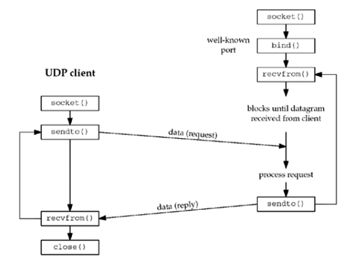

# 基本UDP套接字编程


<!-- @import "[TOC]" {cmd="toc" depthFrom=1 depthTo=6 orderedList=false} -->
<!-- code_chunk_output -->

* [基本UDP套接字编程](#基本udp套接字编程)
	* [概述](#概述)
	* [recvfrom和sendto函数](#recvfrom和sendto函数)
	* [UDP回射服务器程序：main函数](#udp回射服务器程序main函数)
	* [UDP回射服务器程序：dg_echo函数](#udp回射服务器程序dg_echo函数)
	* [UDP回射客户程序：main函数](#udp回射客户程序main函数)
	* [UDP回射客户程序：dg_cli函数](#udp回射客户程序dg_cli函数)
	* [数据报丢失](#数据报丢失)
	* [验证接收到的响应](#验证接收到的响应)
	* [服务器进程未运行](#服务器进程未运行)

<!-- /code_chunk_output -->


## 概述
UDP是无连接不可靠的数据报协议，非常不同于TCP提供的面向连接的可靠字节流。然而相比TCP，有些场合确实更适合使用UDP，使用UDP编写的一些常见的应用程序有：DNS、NFS、SNMP（简单网络管理协议）

典型的UDP客户/服务器程序的函数调用：


## recvfrom和sendto函数
这两个函数类似于标准的read和write函数，不过需要三个额外的参数。
```c
#include <sys/socket.h>

ssize_t recvfrom(int sockfd,void * buff,size_t nytes,int flags,struct sockaddr * from,socklen_t *addrlen);

ssize_t sendto(int sockfd,const void *buff,size_t nbytes,int flags,const struct sockaddr *to,socklen_t addrlen);
//均返回：若成功则为读或写的字节数，若出错则为-1
```
注意，sendto的最后一个参数是一个整数值，而recvfrom的最后一个参数是一个指向整数值的指针（值-结果）。

recvfrom的最后两个参数类似于accept的最后两个参数：返回时其中套接字地址结构的内容告诉我们是谁发送了数据报（UDP情况下）或是谁发起了连接（TCP情况下）。sendto的最后两个参数类似于connect的最后两个参数：调用时其中套接字地址结构被我们填入数据报将发往（UDP情况下）或与之建立连接（TCP情况下）的协议地址。

写一个长度为0的数据报是可行的。recvfrom返回0值是可接受的。

如果recvfrom的from参数是一个空指针，那么相应的长度参数也必须是一个空指针，表示我们并不关心数据发送者的协议地址。
recvfrom和sendto都可以用于TCP，尽管通常没有理由这么做。

## UDP回射服务器程序：main函数

```c
#include "unp.h"

int main(int argc, char const *argv[]) {
	int sockfd;
	struct sockaddr_in servaddr,cliaddr;

	sockfd=Socket(AF_INET,	SOCK_DGRAM,0);

	bzero(&servaddr,sizeof(servaddr));
	servaddr.sin_family=AF_INET;
	servaddr.sin_addr.s_addr=htonl(INADDR_ANY);
	servaddr.sin_port=htons(SERV_PORT);

	Bind(sockfd,(SA *)&servaddr,sizeof(servaddr));
	dg_echo(sockfd,(SA *)&cliaddr,sizeof(cliaddr));
	return 0;
}
```

## UDP回射服务器程序：dg_echo函数

```c
#include "unp.h"

void dg_echo(int sockfd,SA *pcliaddr,socklen_t clilen)
{
	int n;
	socklen_t len;
	char mesg[MAXLINE];

	while (1) {
		len=clien;
		n=Recvfrom(sockfd,mesg,MAXLINE,pcliaddr,&len);

		Sendto(sockfd,mesg,n,0,pcliaddr,len);
	}
}
```

## UDP回射客户程序：main函数
```c
#include "unp.h"

int main(int argc, char const *argv[]) {
	int sockfd;
	struct sockaddr_in servaddr;

	if (argc!=2)
		err_quit("usage:udpcli <IP Address>");

	bzero(&servaddr,sizeof(servaddr));
	servaddr.sin_family=AF_INET;
	servaddr.sin_port=htons(SERV_PORT);
	Inet_pton(AF_INET,argv[1],&servaddr.sin_addr);

	sockfd=Socket(AF_INET,SOCK_DGRAM,0);

	dg_cli(stdin,sockfd,(SA *)&servaddr,sizeof(servaddr));
	return 0;
}
```

## UDP回射客户程序：dg_cli函数
```c
#include "unp.h"

void dg_cli(FILE *fp,int sockfd,const SA * pservaddr,socklen_t servlen)
{
	int n;
	char sendline[MAXLINE],recvline[MAXLINE+1];

	while (Fgets(sendline,MAXLINE,fp)!=NULL)
	{
		Sendto(sockfd,sendline,strlen(sendline),0,pservaddr,servlen);

		n=Recvfrom(sockfd,recvline,MAXLINE,0,NULL,NULL);
		//注意，调用revfrom指定的第五个和第六个参数是空指针。
		//这告知内核我们并不关心应答数据报由谁发送，这样做存在一个风险。
		recvline[n]=0; //null terminate

		Fputs(recvline,stdout);
	}
}
```

## 数据报丢失
我们的UDP客户/服务器例子是不可靠的。如果一个客户数据报丢失（譬如说，被客户主机与服务器主机之间的某个路由器丢弃），客户将永远阻塞于dg_cli函数中的recvfrom调用，等待一个永远不会达到的服务器的应答。类似地，如果客户数据报到达服务器，但是服务器的应答丢失了，客户也将永远阻塞于recvfrom调用。
防止这样永久阻塞的一般方法是给客户的recvfrom调用设置一个超时。我们将在14章讨论。

仅仅给recvfrom调用设置超时并不是完整的解决办法。我们将在22章具体讨论如何给UDP客户/服务器程序增加可靠性。

## 验证接收到的响应

验证返回套接字地址的dg_cli函数版本：
```c
#include "unp.h"

void dg_cli(FILE *fp,int sockfd,const SA *pserveraddr,socklen_t servlen)
{
	int n;
	char sendline[MAXLINE],recvline[MAXLINE+1];
	socklen_t len;
	struct sockaddr * preply_addr;
	preply_addr=Malloc(servlen);

	while (Fgets(sendline,MAXLINE,fp)!=NULL) {
		Sendto(sockfd,sendline,strlen(sendline),0,pservaddr,servlen);

		len=servlen;
		n=Recvfrom(sockfd,sendline,MAXLINE,0,preply_addr,&len);
		if (len !=servlen || memcpy(pserveraddr,preply_addr,len)!=0)
		{
			printf("reply from %s (ignore)\n",Socket_ntop(preply_addr,len) );
			continue;
		}

		recvline[n]=0; //null terminate
		Fputs(recvline,stdout);
	}
}
```

如果服务器运行在一个只有单个IP地址的主机上，那么这个新版本的客户工作正常。然而如果服务器主机是多宿的，该客户就可能失败。

## 服务器进程未运行
我们下一个要检查的情形时在不启动服务器的前提下启动客户。如果我们这么做后在客户上键入一行文本，那么什么也不发生。客户永远阻塞于它的recvfrom调用，等待一个永不出现的服务器应答。

我们启动tcpdump，然后在同一个主机上启动客户，接着，我们键入一行文本，不过这行文本没有被回射。


在客户主机能够往服务器主机发送那个UDP数据报之前，需要一次ARP请求和应答的交换。

从第三行看到客户数据报发出，然而从第四行看到，服务器主机响应的是一个"port unreachable"ICMP消息。不过这个ICMP错误不返回给客户进程，客户永远阻塞于recvfrom调用。

我们称这个ICMP消息为异常错误。该错误由sendto引起，但是森电梯哦本身却成功返回。回顾第二章所述，我们知道从UDP输出操作成功返回仅仅表示在接口输出队列中具有存放所形成IP数据报的空间。该ICMP错误知道后来才返回，这就是称其为异步的原因。

一个基本规则是：对于一个UDP套接字，由它引发的异步错误并不返回给它，除非它已连接。我们将在后面章节讨论如何给UDP套接字调用connect。

[上一级](base.md)
[上一篇](7_socket_opt.md)
