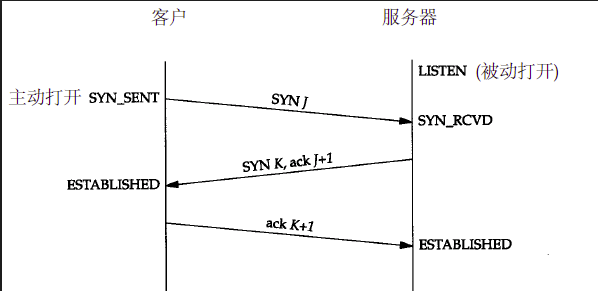
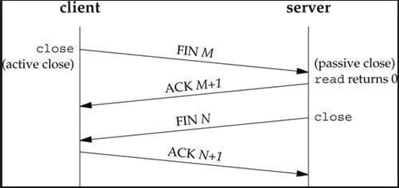
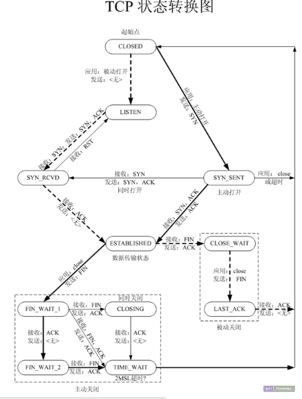

# 2. 传输层：TCP、UDP、SCTP

<!-- @import "[TOC]" {cmd="toc" depthFrom=1 depthTo=6 orderedList=false} -->
<!-- code_chunk_output -->

* [2. 传输层：TCP、UDP、SCTP](#2-传输层tcp-udp-sctp)
	* [概述](#概述)
	* [总图](#总图)
	* [传输控制协议（TCP）](#传输控制协议tcp)
		* [TCP连接的建立和终止](#tcp连接的建立和终止)
			* [三路握手](#三路握手)
			* [TCP选项](#tcp选项)
			* [TCP连接终止](#tcp连接终止)
			* [TCP状态转换图](#tcp状态转换图)
	* [TCP数据传输不同于UDP之处](#tcp数据传输不同于udp之处)
	* [TIME_WAIT状态](#time_wait状态)
	* [SCTP](#sctp)
	* [端口号](#端口号)
	* [缓冲区大小及限制](#缓冲区大小及限制)

<!-- /code_chunk_output -->

## 概述

* UDP是一个简单的、不可靠的数据报协议
* TCP是一个复杂的、可靠的字节流协议
* SCTP与TCP类似之处在于它也是一个可靠的传输协议，但它还提供消息边界、传输级别多宿支持以及将[头端阻塞](https://zh.wikipedia.org/wiki/%E9%98%9F%E5%A4%B4%E9%98%BB%E5%A1%9E),减少到最小的一种方法。

## 总图

* IPv4

网际协议版本4，它使用32位地址，IPv4 给 TCP、UDP、SCTP、ICMP、IGMP提供[分组](https://zh.wikipedia.org/wiki/%E5%88%86%E7%BB%84%E4%BA%A4%E6%8D%A2)递送服务。

* IPv6

* TCP

传输控制协议，TCP是一个面向连接的协议，为用户进程提供可靠的全双工字节流。TCP套接字是一种流套接字。TCP关心确认、超时和重传之类的细节。

* UDP

用户数据报协议。UDP是一个无连接协议。UDP套接字是一种数据报套接字。UDP数据报不能保证最终到达他们的目的地。

* SCTP

流传输控制协议。SCTP是一个提供可靠全双关“关联”的面向连接的协议。

* ICMP

网际控制协议，ICMP处理在路由器和主机之间流通的错误和控制信息

* ARP

地址解析协议。ARP把一个IPv4地址映射成一个硬件地址（如[以太网](https://zh.wikipedia.org/wiki/%E4%BB%A5%E5%A4%AA%E7%BD%91)地址）

* 补充

[网络交换机](https://zh.wikipedia.org/wiki/%E7%B6%B2%E8%B7%AF%E4%BA%A4%E6%8F%9B%E5%99%A8)

[路由器](https://zh.wikipedia.org/wiki/%E8%B7%AF%E7%94%B1%E5%99%A8)

## 传输控制协议（TCP）

TCP提供了可靠性。当TCP向另一端发送数据时，它要求对端返回一个确认。如果没有收到确认，TCP就自动重传数据并等待更长的时间。在数次重传失败后，TCP才放弃，如此在尝试发送数据上所花的时间一般是4～10分钟（依赖于具体的实现）。

TCP含有用于动态估算客户和服务器之间的往返时间（RTT）的算法，以便知道等待一个确认需要多少时间。

### TCP连接的建立和终止

#### 三路握手

SYN：同步
ACK：确认
#### TCP选项

每一个SYN可以包含多个TCP选项。下面是常用的TCP选项

* MSS:最大分节大小

* 窗口规模选项

* 时间戳选项

#### TCP连接终止
TCP建立一个连接需要3个分节，终止一个连接则需要4个分节。

#### TCP状态转换图

## TCP数据传输不同于UDP之处
* 有序数据传输
* 重发丢失的数据包
* 舍弃重复的数据包
* 无错误数据传输
* 阻塞/流量控制
* 面向连接（确认有创建三方交握，连接已创建才作传输。）

## TIME_WAIT状态

在上图中，我们看到执行主动关闭的那端经历了这个状态。该端点停留在这个状态的持续时间是最长分节生命期的两倍，有时候称之为2MSL。
TIME_WAIT状态有两个存在的理由：

1. 可靠的实现TCP全双工连接的终止
2. 允许老的重复分节在网络中消逝

## SCTP

SCTP在客户和服务器之间提供“关联”，并像TCP那样给应用提供可靠性、排序、流量控制以及全双工的数据传送。

SCTP能够在所连接的端点之间提供多个流，每个流各自可靠的按序递送消息。

SCTP还提供多宿特性，使得单个SCTP端点能够支持多个IP地址。

## 端口号

任何时候，多个进程可能同时使用TCP、UDP、和SCTP这三种传输协议中的任何一种。这些协议都使用16位整数的端口号来区分这些进程。

IANA（因特网已分配数值权威机构）维护着一个端口号分配状况的清单。

1. 众所周知的端口为0～1023.为系统的保留端口，这些端口只能赋予特权用户进程的套接字，必须以超级用户特权启动。

2. 已登记的端口1024～49151。RFC 1700所列的上限为65535。

3. 49152～65535是动态的或私用的端口。

## 缓冲区大小及限制

* IPv4数据报最大大小是65535字节，包括IPv4首部
* IPv6数据报最大大小是65575字节，包括40字节的IPv6首部
* MTU（[最大传输单元](https://zh.wikipedia.org/wiki/%E6%9C%80%E5%A4%A7%E4%BC%A0%E8%BE%93%E5%8D%95%E5%85%83)）

* 当两个主机之间的路径中最小的MTU称为路径MTU
* 当一个IP数据报将从某个接口送出时，如果它的大小超出相应链路的MTU，IPv4,IPv6都将执行分片。这些片段在到达目的地之前通常不会被重组

* IPv4首部的 “不分片”位（即DF位）若被设置，那么不管时发送这些数据报的主机还是转发他们的路由器，都不允许对他们分片。当路由器接收到一个超出其外出链路MTU大小且设置了DF位的IPv4数据报时，他将产生一个ICMPv4“destination unreachable,fragmentation needed but DF bit set”出错

* IPv4 IPv6都定义了最小重组缓冲区大小，他是IPv4 IPv6的任何实现都必须支持的最小数据报大小。ipv4:576 byte,IPv6:1500 byte

* 最大分节大小（Maximum Segment Size），是 TCP 连接建立过程中由 SYN 分节的 MSS 选项指定的，用于向对端 TCP 通告对端在每个分节中能发送的最大 TCP 数据量（不包括分节的头部）。MSS 经常设置成 MTU 减去 IP 和 TCP 头部的固定长度，比如在以太网中使用 IPv4 的 MSS 值为1460（因为以太网的 MTU 一般为1500字节，而 TCP 和 IPv4 头部一般为20字节），这样最大的 IP 数据包也就是1500字节，这样的数据包进入以太网链路之前中就不需要重新分片，可见通过指定 MSS 能够避免分片。MSS 是应用层与传输层（TCP）之间的接口属性，TCP 协议在构造一个分节时一般从 TCP 缓冲区取不大于 MSS 的字节数作为分节的数据部分。                                                                       
[上一级](base.md)
[上一篇](socket_program_into.md)
